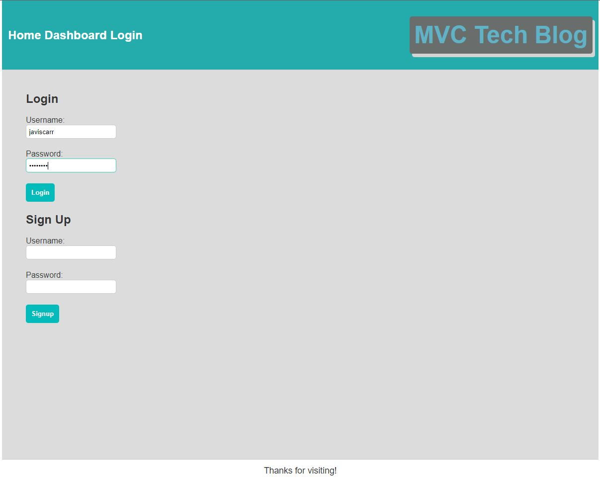
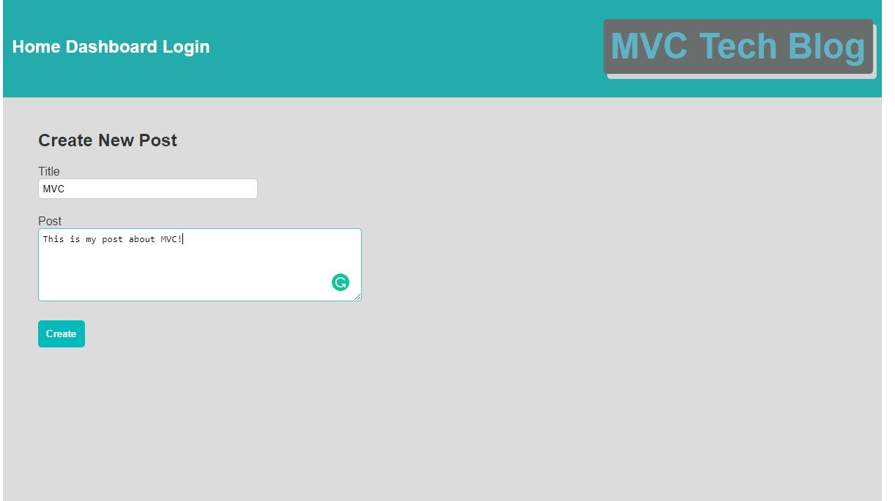
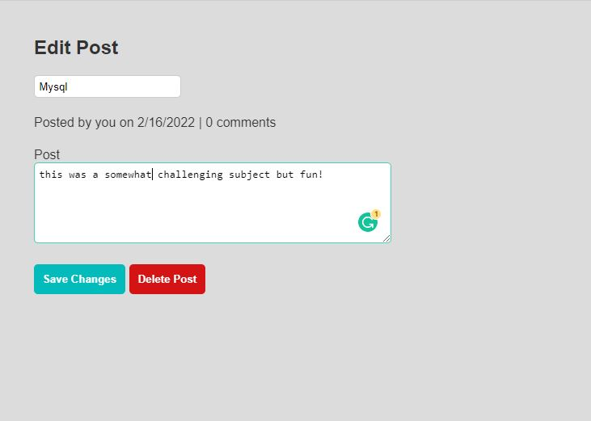
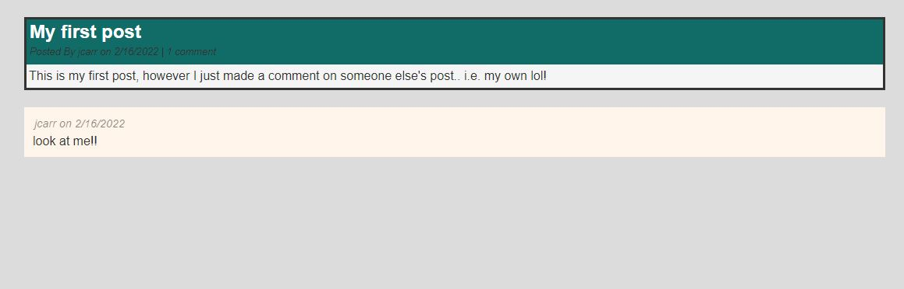
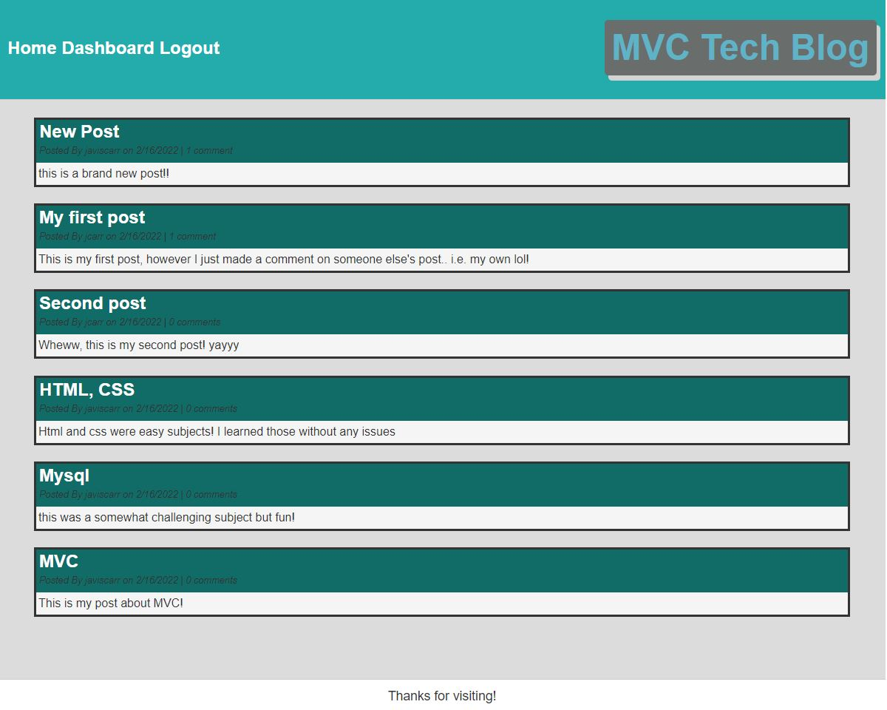

# MVC-Tech-Blog

## Table of Contents

- [Description](#description)
- [Demo](#demo)
- [Screenshots](#screenshots)
- [Usage](#usage)

## Description

This app utilizes many different files, database storage, and technologies to create a Tech blog. A user can view any blogs on the main page and click them to see the comments. Both the post and comments will show who posted them.

If a user would like to create their own blog they can sign up to create an account or login to an existing one. Once logged in, the user will then have access to a dashboard for posting blogs. The user can also go to other blogs and comment on them leaving their name and a date.

The user is able to logout in order to end their session.

# Demo

[Play Demonstration](https://watch.screencastify.com/v/lIJ8J8F2UhUxyb9rsul7)

# Screenshot

_This is the login and user sign up page!_

_Here users are able to create new posts to add to the dashboard._

_Users are also able to edit posts if needed._

_Users who are logged in are able to comment on other users post and will be listed on the dashboard._

_The homepage will list all of the post be each user and display who the post was submitted by, when it was submitted and if any comments have been made on the post._

# Usage

You can access the deployed application by click this [link](https://javis-mvc-tech-blog.herokuapp.com/)

Once you have navigated to the link above, you will then be able to create an account or view the first few blogs and comments.

# Contact

## **_Javis Carr_**

**_Email:_** Javis.Carr@gmail.com

**_Linkedin:_** [Click Here](https://www.linkedin.com/in/javis-carr-8a584533/)
